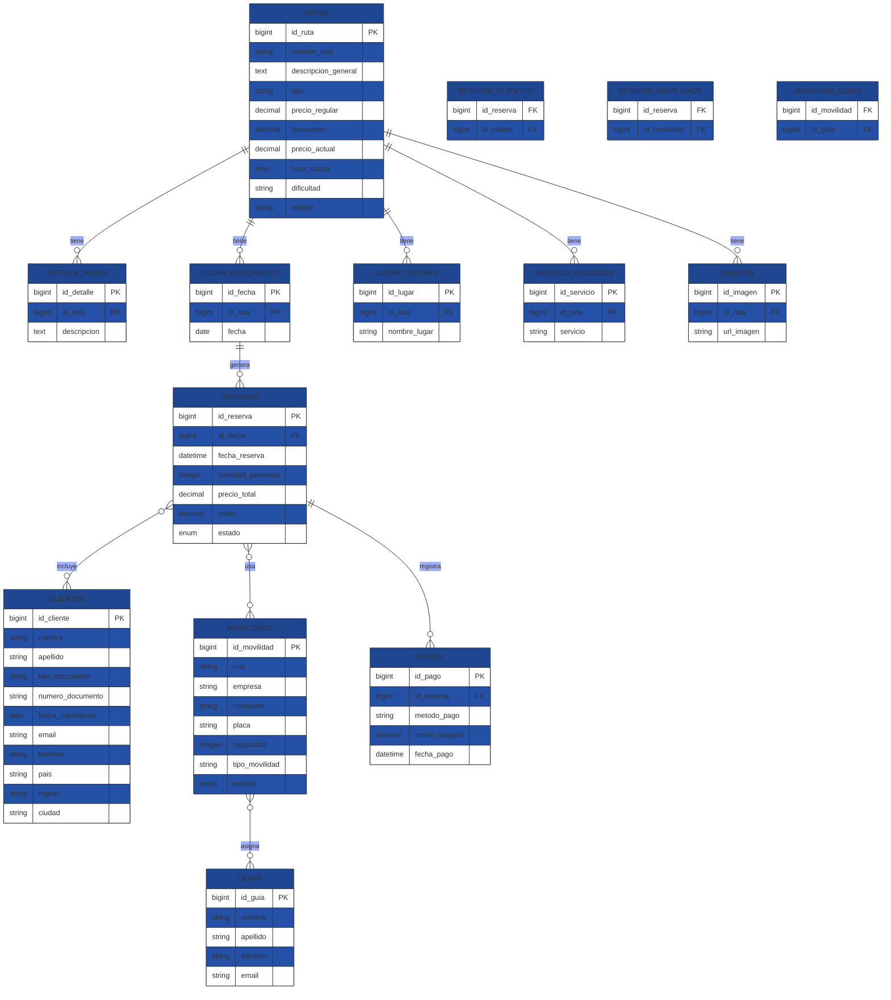

# Documentación de la Base de Datos

## I. Visión general

Esta documentación describe la estructura de la base de datos del proyecto de gestión de tours al Outdoor. Se basa en las migraciones definidas en `database/migrations`, los modelos de Eloquent en `app/Models`, y los archivos de fábrica/seeders disponibles.

El sistema gestiona:
- Rutas y sus características.
- Fechas disponibles para tours.
- Reservas de clientes.
- Clientes y acompañantes.
- Pagos asociados a reservas.
- Movilidades (vehículos) y guías.
- Relación entre reservas, vehículos y guías.

## II. Tablas principales y columnas

### 2.1 `rutas`
- `id_ruta` (bigint unsigned, PK)
- `nombre_ruta` (string)
- `descripcion_general` (text, nullable)
- `tipo` (string, nullable)
- `precio_regular` (decimal 10,2)
- `descuento` (decimal 10,2, default 0)
- `precio_actual` (decimal 10,2)
- `hora_salida` (time)
- `dificultad` (string, nullable)
- `estado` (string, default `Activo`, con restricción `Activo`/`Inactivo`)
- `created_at`, `updated_at` (timestamps)

### 2.2 `detalle_rutas`
- `id_detalle` (bigint unsigned, PK)
- `id_ruta` (foreignId → `rutas.id_ruta`)
- `descripcion` (text, nullable)
- `created_at`, `updated_at` (timestamps)

### 2.3 `fecha_disponibles`
- `id_fecha` (bigint unsigned, PK)
- `id_ruta` (foreignId → `rutas.id_ruta`)
- `fecha` (date)
- `created_at`, `updated_at` (timestamps)

### 2.4 `lugar_visitars`
- `id_lugar` (bigint unsigned, PK)
- `id_ruta` (foreignId → `rutas.id_ruta`)
- `nombre_lugar` (string)
- `created_at`, `updated_at` (timestamps)

### 2.5 `servicio_incluidos`
- `id_servicio` (bigint unsigned, PK)
- `id_ruta` (foreignId → `rutas.id_ruta`)
- `servicio` (string)
- `created_at`, `updated_at` (timestamps)

### 2.6 `imagens`
- `id_imagen` (bigint unsigned, PK)
- `id_ruta` (foreignId → `rutas.id_ruta`)
- `url_imagen` (string 500)
- `created_at`, `updated_at` (timestamps)

### 2.7 `reservas`
- `id_reserva` (bigint unsigned, PK)
- `id_fecha` (foreignId → `fecha_disponibles.id_fecha`)
- `fecha_reserva` (datetime)
- `cantidad_personas` (integer)
- `precio_total` (decimal 10,2)
- `saldo` (decimal 10,2)
- `estado` (`enum`: `Pendiente`, `Pagado`, `Abordo`, `Cancelado`; default `Pendiente`)
- `created_at`, `updated_at` (timestamps)

### 2.8 `clientes`
- `id_cliente` (bigint unsigned, PK)
- `nombre` (string)
- `apellido` (string)
- `tipo_documento` (string 15)
- `numero_documento` (string 15)
- `fecha_nacimiento` (date)
- `email` (string, nullable)
- `telefono` (string 20, nullable)
- `pais` (string 50, nullable)
- `region` (string 50, nullable)
- `ciudad` (string 50, nullable)
- `created_at`, `updated_at` (timestamps)

### 2.9 `reserva_clientes`
- `id_reserva` (foreignId → `reservas.id_reserva`)
- `id_cliente` (foreignId → `clientes.id_cliente`)
- `created_at`, `updated_at` (timestamps)
- Primary key compuesta: [`id_reserva`, `id_cliente`]

### 2.10 `movilidads`
- `id_movilidad` (bigint unsigned, PK)
- `ruta` (string)
- `empresa` (string)
- `conductor` (string)
- `placa` (string)
- `capacidad` (integer)
- `tipo_movilidad` (string)
- `estado` (`enum`: `Disponible`, `Ocupado`; default `Disponible`)
- `created_at`, `updated_at` (timestamps)

### 2.11 `reserva_movilidads`
- `id_reserva` (foreignId → `reservas.id_reserva`)
- `id_movilidad` (foreignId → `movilidads.id_movilidad`)
- `created_at`, `updated_at` (timestamps)
- Primary key compuesta: [`id_reserva`, `id_movilidad`]

### 2.12 `guias`
- `id_guia` (bigint unsigned, PK)
- `nombre` (string)
- `apellido` (string)
- `telefono` (string 20, nullable)
- `email` (string, unique)
- `created_at`, `updated_at` (timestamps)

### 2.13 `movilidad_guias`
- `id_movilidad` (foreignId → `movilidads.id_movilidad`)
- `id_guia` (foreignId → `guias.id_guia`)
- `created_at`, `updated_at` (timestamps)
- Primary key compuesta: [`id_movilidad`, `id_guia`]

### 2.14 `pagos`
- `id_pago` (bigint unsigned, PK)
- `id_reserva` (foreignId → `reservas.id_reserva`)
- `metodo_pago` (string)
- `monto_pagado` (decimal 10,2)
- `fecha_pago` (datetime)
- `created_at`, `updated_at` (timestamps)

## III. Relaciones Eloquent (modelos)

### 3.1 Relación `Ruta`
- `Ruta::detalles()` → hasMany(DetalleRuta, `id_ruta`)
- `Ruta::fechasDisponibles()` → hasMany(FechaDisponible, `id_ruta`)
- `Ruta::lugaresVisitar()` → hasMany(LugarVisitar, `id_ruta`)
- `Ruta::serviciosIncluidos()` → hasMany(ServicioIncluido, `id_ruta`)
- `Ruta::imagenes()` → hasMany(Imagen, `id_ruta`)

### 3.2 Relación `DetalleRuta`
- `DetalleRuta::ruta()` → belongsTo(Ruta, `id_ruta`)

### 3.3 Relación `FechaDisponible`
- `FechaDisponible::ruta()` → belongsTo(Ruta, `id_ruta`)

### 3.4 Relación `LugarVisitar`
- `LugarVisitar::ruta()` → belongsTo(Ruta, `id_ruta`)

### 3.5 Relación `ServicioIncluido`
- `ServicioIncluido::ruta()` → belongsTo(Ruta, `id_ruta`)

### 3.6 Relación `Imagen`
- `Imagen::ruta()` → belongsTo(Ruta, `id_ruta`, `id_ruta`)

### 3.7 Relación `Reserva`
- `Reserva::fechaDisponible()` → belongsTo(FechaDisponible, `id_fecha`)
- `Reserva::clientes()` → belongsToMany(Cliente, `reserva_clientes`, `id_reserva`, `id_cliente`)
- `Reserva::movilidads()` → belongsToMany(Movilidad, `reserva_movilidads`, `id_reserva`, `id_movilidad`) + `with('guias')`
- `Reserva::pagos()` → hasMany(Pago, `id_reserva`, `id_reserva`)

### 3.8 Relación `Cliente`
- `Cliente::reservas()` → belongsToMany(Reserva, `reserva_clientes`, `id_cliente`, `id_reserva`)

### 3.9 Relación `Movilidad`
- `Movilidad::reservas()` → belongsToMany(Reserva, `reserva_movilidads`, `id_movilidad`, `id_reserva`)
- `Movilidad::guias()` → belongsToMany(Guia, `movilidad_guias`, `id_movilidad`, `id_guia`)

### 3.10 Relación `Guia`
- `Guia::movilidads()` → belongsToMany(Movilidad, `movilidad_guias`, `id_guia`, `id_movilidad`)

### 3.11 Relación `ReservaCliente`
- Modelo pivot sin relaciones explícitas declaradas.
- `protected $primaryKey = 'id_reserva';` en el modelo es inconsistente con la migración, ya que la tabla tiene llave primaria compuesta.

### 3.12 Relación `ReservaMovilidad`
- Modelo pivot sin relaciones explícitas declaradas.
- Define `protected $primaryKey = 'id_reserva_movilidad';` pero la tabla no tiene esa columna en la migración.

### 3.13 Relación `MovilidadGuia`
- Modelo pivot sin relaciones explícitas declaradas.
- Define `protected $primaryKey = ['id_movilidad', 'id_guia'];`, pero Eloquent no soporta llaves primarias compuestas de esa forma de forma nativa.

### 3.14 Relación `Pago`
- La migración indica `pagos.id_reserva` como foreign key hacia `reservas.id_reserva`.
- El modelo `Pago` define incorrectamente la relación:
  - `return $this->hasMany(Pago::class, 'id_reserva', 'id_reserva');`
  - Esto es un error claro: debería ser `belongsTo(Reserva::class, 'id_reserva', 'id_reserva')`.
- El modelo `Reserva` sí implementa `pagos()` correctamente como `hasMany(Pago::class, 'id_reserva', 'id_reserva')`.

## IV. Explicación funcional de cada entidad

### 4.1 `Ruta`
Representa un tour o paquete turístico. Contiene datos de precio, tipo, dificultad, hora de salida y estado. Es la entidad raíz para:
- detalles de itinerario (`detalle_rutas`)
- fechas disponibles (`fecha_disponibles`)
- lugares a visitar (`lugar_visitars`)
- servicios incluidos (`servicio_incluidos`)
- imágenes (`imagens`)

### 4.2 `DetalleRuta`
Guarda las descripciones paso a paso o itinerarios asociados a una ruta. Cada detalle pertenece a una sola ruta.

### 4.3 `FechaDisponible`
Define fechas específicas en las que un tour está disponible. Las reservas se enlazan a esta tabla, no directamente a la ruta.

### 4.4 `LugarVisitar`
Puntos de interés o destinos dentro de una ruta. Permite describir el trayecto turístico.

### 4.5 `ServicioIncluido`
Enumera servicios incluidos en la ruta, como alimentación, transporte o equipo.

### 4.6 `Imagen`
Fotos relacionadas a una ruta. El accessor `getUrlImagenAttribute` en el modelo genera una URL completa usando `asset()`.

### 4.7 `Reserva`
Registro de una reserva realizada. Está anclada a una fecha disponible y guarda total/pago/estado.
- `cantidad_personas` determina tamaño del grupo.
- `saldo` puede reflejar pago parcial.
- `estado` controla la etapa: pendiente, pagado, abordo o cancelado.
- Se enlaza con clientes, vehículos y pagos.

### 4.8 `Cliente`
Datos personales de un pasajero o comprador. Se usa en reservas como cliente principal y acompañantes.

### 4.9 `ReservaCliente`
Tabla pivot que asigna clientes a reservas.
- Tiene PK compuesta `id_reserva` + `id_cliente`.
- Permite múltiples clientes por reserva y múltiples reservas por cliente.

### 4.10 `Movilidad`
Vehículos disponibles para tours. Tiene estado de disponibilidad y se vincula con reservas y guías.

### 4.11 `ReservaMovilidad`
Tabla pivot que asigna vehiculos a reservas.
- Tiene PK compuesta `id_reserva` + `id_movilidad`.
- Representa qué transporte se usa en cada reserva.

### 4.12 `Guia`
Guías que acompañan rutas. Sus datos incluyen contacto y email único.

### 4.13 `MovilidadGuia`
Tabla pivot que une vehículos con guías.
- Tiene PK compuesta `id_movilidad` + `id_guia`.
- Indica qué guía puede trabajar en cada vehículo.

### 4.14 `Pago`
Registro de transacciones por reserva.
- Guarda método, monto y fecha de pago.
- Debe pertenecer a una reserva.
- La relación en el modelo actual está mal definida.

## V. Diagrama ER

## VI. Llaves compuestas en tablas pivot

### 6.1 `reserva_clientes`
- Es una tabla pivot entre `reservas` y `clientes`.
- La migración define la clave primaria compuesta `['id_reserva', 'id_cliente']`.
- Esto asegura que un mismo cliente no pueda repetirse dos veces en la misma reserva.
- En Eloquent, el modelo `ReservaCliente` no declara esta llave compuesta correctamente.

### 6.2 `reserva_movilidads`
- Es una tabla pivot entre `reservas` y `movilidads`.
- La migración define la clave primaria compuesta `['id_reserva', 'id_movilidad']`.
- Esto significa que un vehículo está vinculado una sola vez a una reserva específica.
- El modelo `ReservaMovilidad` contiene un `primaryKey` inválido (`id_reserva_movilidad`) que no existe en la tabla.

### 6.3 `movilidad_guias`
- Es una tabla pivot entre `movilidads` y `guias`.
- La migración define `['id_movilidad', 'id_guia']` como clave primaria compuesta.
- El modelo `MovilidadGuia` intenta reflejarlo con `protected $primaryKey = ['id_movilidad', 'id_guia'];`, pero Eloquent no soporta composite keys nativas.
- En la práctica, el pivot puede funcionar mejor si se trata como un modelo sin primaryKey o se usa `protected $primaryKey = null; public $incrementing = false;`.

## VII. Inconsistencias detectadas

### 7.1 `Pago`
- Migración: `pagos` tiene una FK `id_reserva` hacia `reservas`.
- Modelo: la relación `reserva()` está definida como `hasMany(Pago::class, 'id_reserva', 'id_reserva')`.
- Esto es incorrecto; debe ser `belongsTo(Reserva::class, 'id_reserva', 'id_reserva')`.
- Consecuencia: si se usa `Pago::first()->reserva`, no devolverá la reserva correcta y el ORM puede comportarse de forma inesperada.

### 7.2 Tablas pivot con llaves compuestas
- `ReservaCliente`:
  - Modelo define `protected $primaryKey = 'id_reserva';`.
  - La tabla tiene PK compuesta entre `id_reserva` y `id_cliente`.
  - Esto es inconsistente y puede causar problemas con algunas operaciones Eloquent.
- `ReservaMovilidad`:
  - Modelo define `protected $primaryKey = 'id_reserva_movilidad';`.
  - La tabla NO define `id_reserva_movilidad`.
  - La definición del modelo es errónea.
- `MovilidadGuia`:
  - Modelo define un `primaryKey` compuesto no soportado por Eloquent.
  - Debería manejarse como un pivot sin clave primaria o con `public $incrementing = false; protected $primaryKey = null;`.

### 7.3 Modelo `ServicioIncluido`
- El archivo contiene dos declaraciones `namespace App\Models;` consecutivas.
- Esto es un error de sintaxis potencial y podría romper la clase cuando se intente cargar.

### 7.4 Posibles diferencias entre migración y modelo
- `rutas` tiene timestamps en migración, pero el modelo `Ruta` establece `public $timestamps = false;`.
  - Esto es una inconsistencia funcional: la tabla guarda `created_at` y `updated_at`, pero el modelo indica que no hay timestamps.
- `FechaDisponible`, `DetalleRuta`, `LugarVisitar`, `ServicioIncluido`, `Imagen`, `Reserva`, `Cliente`, `Movilidad`, `Guia`, `Pago` no expresan `public $timestamps = true`, pero lo heredan como true, lo cual coincide con la migración.
- `Imagen::getUrlImagenAttribute` asume que el campo `url_imagen` debe convertirse a `asset()`. Si el valor ya es URL completa, el resultado puede quedar incorrecto.

## VIII. Observaciones sobre fábricas y seeders

- No existen fábricas específicas para las entidades del dominio (`Ruta`, `Reserva`, `Cliente`, `Movilidad`, `Guia`, etc.).
- Solo hay fábricas de `User` y `Team` generadas por Jetstream.
- El seeder `DatabaseSeeder` solo registra roles y usuarios.
- No hay datos de prueba predeterminados para tours, fechas, reservas, pagos o relaciones entre ellos.

## IX. Recomendaciones rápidas

- Corregir `Pago::reserva()` a `belongsTo(Reserva::class, 'id_reserva', 'id_reserva')`.
- Ajustar los modelos pivot:
  - `ReservaCliente`: eliminar `protected $primaryKey` o usar `protected $primaryKey = null; public $incrementing = false;`.
  - `ReservaMovilidad`: eliminar el `primaryKey` inválido y establecer `protected $primaryKey = null; public $incrementing = false;`.
  - `MovilidadGuia`: mantener `public $incrementing = false; protected $primaryKey = null;` en lugar de intentar `$primaryKey = ['id_movilidad', 'id_guia'];`.
- Arreglar `ServicioIncluido.php` para tener una sola declaración de namespace.
- Sincronizar `Ruta` con `timestamps` si la tabla los mantiene.
- Crear fábricas/seeders para las entidades de dominio si se desea pruebas automatizadas o datos de desarrollo.

---

Esta documentación refleja la estructura actual del proyecto sin realizar cambios en el código. Las inconsistencias y errores señalados son reales según las migraciones y los modelos existentes.