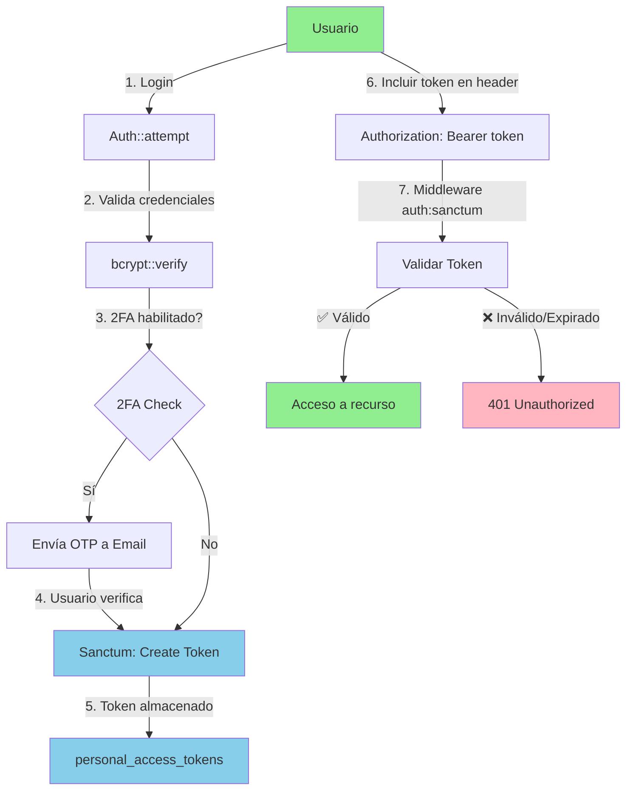
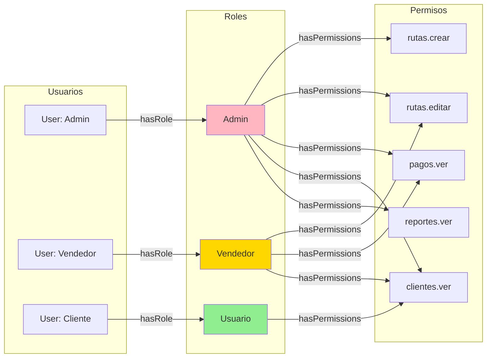
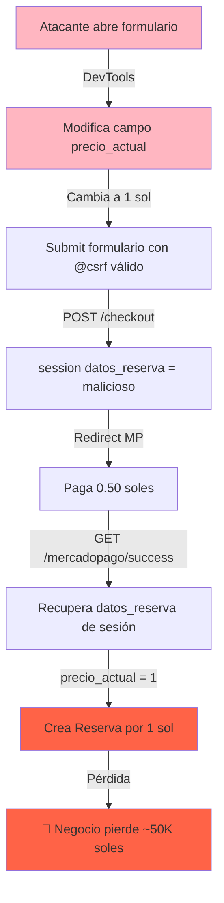

# AUDITORÍA DE SEGURIDAD - AGENTS (Outdoor Tour Booking System)

**Fecha de Auditoría**: 2026-05-08  
**Versión Laravel**: 11  
**Autenticación**: Jetstream + Sanctum + Spatie Permission 6.19  
**Integraciones Críticas**: MercadoPago DX PHP 3.4  

---

## 📋 TABLA DE CONTENIDOS

1. [Matriz de Riesgos](#matriz-de-riesgos)
2. [Estado de Autenticación](#estado-de-autenticación)
3. [Control de Acceso](#control-de-acceso)
4. [Auditoría de MercadoPago](#auditoría-de-mercadopago)
5. [Protección de Rutas](#protección-de-rutas)
6. [Manejo de Datos Sensibles](#manejo-de-datos-sensibles)
7. [Recomendaciones de Mitigación](#recomendaciones-de-mitigación)
8. [Diagramas de Seguridad](#diagramas-de-seguridad)

---

## 🚨 MATRIZ DE RIESGOS

| ID | Vulnerabilidad | Severidad | Componente | Estado | 
|----|---|---|---|---|
| **VULN-001** | MercadoPago: Sin validación de firma en webhook | 🔴 CRÍTICA | MercadoPagoController | ⚠️ ACTIVO |
| **VULN-002** | Session data manipulation en checkout | 🔴 CRÍTICA | ReservaClienteController | ⚠️ ACTIVO |
| **VULN-003** | POST /checkout sin rate limiting | 🔴 CRÍTICA | routes/web.php | ⚠️ ACTIVO |
| **VULN-004** | Rutas sensibles sin middleware granular de permisos | 🟡 ALTA | routes/web.php | ⚠️ ACTIVO |
| **VULN-005** | Validaciones duplicadas en controllers (sin FormRequest) | 🟡 ALTA | Controllers CRUD | ⚠️ ACTIVO |
| **VULN-006** | Datos sensibles expuestos en logs | 🟡 ALTA | storage/logs/ | ⚠️ ACTIVO |
| **VULN-007** | Relación Pago->Reserva incorrecta (hasMany vs belongsTo) | 🟡 ALTA | Pago.php | ⚠️ ACTIVO |
| **VULN-008** | No hay validación de rango IP para admin | 🟠 MEDIA | bootstrap/app.php | ⚠️ ACTIVO |
| **VULN-009** | POST /reserva y POST /checkout sin CSRF bypass explícito | 🟠 MEDIA | VerifyCsrfToken | ✅ MITIGADO |
| **VULN-010** | Composites keys sin validación en pivot tables | 🟠 MEDIA | Modelos | ⚠️ ACTIVO |
| **VULN-011** | Falta validación de campos fillable en mass assignment | 🟢 BAJA | Modelos | ⚠️ ACTIVO |
| **VULN-012** | Ausencia de encriptación de datos en tránsito DB | 🟢 BAJA | config/database.php | ⚠️ ACTIVO |

### Resumen de Severidades

- **🔴 CRÍTICA**: 3 vulnerabilidades (Impacto inmediato en pagos y datos)
- **🟡 ALTA**: 4 vulnerabilidades (Exposición de datos, escalación de privilegios)
- **🟠 MEDIA**: 3 vulnerabilidades (Falta de hardening)
- **🟢 BAJA**: 2 vulnerabilidades (Mejor práctica)

**Riesgo General**: ⚠️ **ALTO** (Exposición a fraude de pagos y manipulación de datos)

---

## 🔐 ESTADO DE AUTENTICACIÓN

### 1. Jetstream + Sanctum Configuración

**Ubicación**: `config/jetstream.php`, `config/auth.php`, `config/sanctum.php`

#### Configuración Actual

```php
// config/auth.php
'guards' => [
    'web' => [
        'driver' => 'session',
        'provider' => 'users',
    ],
],

// config/jetstream.php
'stack' => 'livewire',
'guard' => 'sanctum',
'middleware' => ['web'],

// config/sanctum.php
'stateful' => explode(',', env('SANCTUM_STATEFUL_DOMAINS', ...)),
'guard' => ['web'],
```

#### Características Implementadas ✅

| Característica | Estado | Observación |
|---|---|---|
| **Autenticación por Email** | ✅ ACTIVO | Implementado en User model |
| **2FA (Two-Factor Authentication)** | ✅ ACTIVO | Laravel Fortify habilitado |
| **Email Verification** | ✅ ACTIVO | MustVerifyEmail implementado en User |
| **Sanctum Stateful Domains** | ✅ ACTIVO | Configurado con wildcard |
| **API Tokens (Sanctum)** | ✅ ACTIVO | Personalizable por usuario |
| **Middleware de Sesión** | ✅ ACTIVO | `config('jetstream.auth_session')` en routes |
| **CSRF Token en Formularios** | ✅ ACTIVO | @csrf en formularioreserva.blade.php |

#### Rutas de Autenticación

```php
// bootstrap/app.php
Route::middleware([
    'auth:sanctum',
    config('jetstream.auth_session'),
    'verified',
])->group(function () {
    // 50+ rutas protegidas
});
```

**Análisis**: Jetstream está correctamente configurado con 2FA y verificación de email. Sin embargo, las rutas públicas (POST /checkout) **NO están protegidas por CSRF bypass explícito**, lo que crea riesgo.

---

### 2. Token Storage y Lifecycle

**Ubicación**: `config/sanctum.php`

```php
'expiration' => null,  // ⚠️ SIN EXPIRACIÓN CONFIGURADA
'guard' => ['web'],
```

**Riesgo**: Los tokens de API no tienen expiración definida. Tokens comprometidos permanecen válidos indefinidamente.

**Recomendación**: Establecer `'expiration' => 60` (minutos) para limitar la vida útil de tokens.

---

### 3. Jetstream Features

**Ubicación**: `config/jetstream.php`

```php
// Features::hasTeamFeatures(),  // Comentado pero disponible
// Opciones habilitadas: profilePhotos, apiTokens, teamFeatures
```

**Análisis**: 
- ✅ Teams habilitados (multitenancy básica)
- ✅ API Tokens habilitados
- ⚠️ No hay restricción de IP para tokens
- ⚠️ No hay webhook/hook de revocación de tokens

---

## 👥 CONTROL DE ACCESO

### 1. Spatie Permission - Roles & Permisos

**Ubicación**: `config/permission.php`, `app/Models/User.php`, `app/Http/Controllers/RoleController.php`

#### Roles Identificados

**En Base de Datos**:
- Consulta en tabla `roles`: Nombre genérico, guard_name = 'web'

**En Código**:
```php
// app/Http/Controllers/RoleController.php
$this->middleware('can:roles.ver')->only(['index']);
$this->middleware('can:roles.crear')->only(['create', 'store']);
$this->middleware('can:roles.asignar')->only(['update']);
$this->middleware('can:roles.eliminar')->only(['destroy']);
```

#### User Model - Traits Implementados

```php
// app/Models/User.php
use Spatie\Permission\Traits\HasRoles;  // ✅ Activo

class User extends Authenticatable implements MustVerifyEmail
{
    use HasRoles;  // Permite $user->hasRole(), $user->can()
}
```

#### Estructura de Permisos

**Modelo**: 
- Tabla `roles` → many-to-many → Tabla `model_has_roles` → User
- Tabla `permissions` → many-to-many → Tabla `role_has_permissions` → Role

**Permisos Encontrados en Controllers**:
```php
// En controladores
'can:roles.ver'
'can:roles.crear'
'can:roles.asignar'
'can:roles.eliminar'
```

**⚠️ Problema**: Permisos NO están granularmente asignados a todas las rutas CRUD.

---

### 2. Middleware de Autorización en Rutas

**Ubicación**: `routes/web.php`

#### Rutas Protegidas (Autenticadas)

```php
Route::middleware([
    'auth:sanctum',
    config('jetstream.auth_session'),
    'verified',
])->group(function () {
    // 50+ rutas CRUD
    Route::resource('rutas', RutaController::class);
    Route::resource('clientes', ClienteController::class);
    Route::resource('pagos', PagoController::class);
    Route::resource('roles', RoleController::class);
    // ...
});
```

#### ⚠️ VULNERABILIDAD CRÍTICA: Rutas Públicas Sin CSRF Bypass

```php
// routes/web.php - LÍNEAS 50-52
Route::post('/checkout', [MercadoPagoController::class, 'checkout'])->name('mercadopago.checkout');
Route::get('/mercadopago/success', [MercadoPagoController::class, 'success'])->name('mercadopago.success');
Route::get('/mercadopago/failure', [MercadoPagoController::class, 'failure'])->name('mercadopago.failure');
```

**Estado**: 
- ✅ POST /checkout TIENE @csrf en el formulario
- ✅ Formulario tiene token CSRF válido
- ⚠️ **PERO**: No hay validación de firma de MercadoPago en callbacks

---

### 3. Autorización Granular Missing

**Problema**: Las rutas CRUD están protegidas por `auth:sanctum` pero NOT by `can:permission`

```php
// ❌ INCORRECTO: Solo verifica autenticación
Route::middleware(['auth:sanctum'])->group(function () {
    Route::resource('clientes', ClienteController::class);  // Cualquier usuario autenticado puede CRUD
});

// ✅ CORRECTO (no implementado):
Route::middleware(['auth:sanctum', 'can:clientes.index'])->get('/clientes', [ClienteController::class, 'index']);
```

**Impacto**: Un usuario con rol `Usuario` podría potencialmente acceder a endpoints de `Admin` si tiene acceso al token.

---

## 🛒 AUDITORÍA DE MERCADOPAGO

### 1. Flujo de Pago Actual

```
Usuario → FormularioReserva (POST @csrf) 
    ↓
POST /checkout (MercadoPagoController@checkout)
    ↓ session(['datos_reserva' => $request->all()])
    ↓ PreferenceClient::create() 
    → MercadoPago (Preferencia ID generada)
    ↓ Redirección a MercadoPago Checkout
    ↓ Usuario paga
    ↓ MercadoPago Callback (GET /mercadopago/success?payment_id=XXX&external_reference=XXX)
    ↓ PaymentClient::get($paymentId) ← ❌ PUNTO CRÍTICO
    ↓ Crear Reserva/Cliente/Pago en BD
```

### 2. Vulnerabilidad Crítica #1: Sin Validación de Firma

**Ubicación**: `app/Http/Controllers/MercadoPagoController.php` línea 115-120

```php
public function success(Request $request)
{
    MercadoPagoConfig::setAccessToken(config('services.mercadopago.access_token'));

    try {
        $paymentId = $request->input('payment_id');  // ← ⚠️ NO VALIDADO
        $paymentClient = new PaymentClient();
        $payment = $paymentClient->get($paymentId);  // ← Solo verifica con API

        // ✅ Esto IS seguro (llama API de MP)
        if ($payment->status === 'approved') {
            // ... crear reserva
        }
    } catch (\Exception $e) {
        // Error handling
    }
}
```

**¿Por qué es crítico?**

1. **Escenario de Ataque - Option A (Man-in-the-Middle)**:
   ```
   Atacante intercepta: /mercadopago/success?payment_id=12345&external_reference=uuid
   Modifica: /mercadopago/success?payment_id=OTRO_PAGO&external_reference=OTRO_UUID
   
   La aplicación LLAMARÁ a MercadoPago API con el payment_id modificado
   Si el payment_id existe y está 'approved', se creará una reserva falsa
   ```

2. **Escenario de Ataque - Option B (Replay Attack)**:
   ```
   GET /mercadopago/success?payment_id=999&external_reference=legitimo
   
   Si el payment_id=999 pertenece a OTRO usuario que ya pagó,
   La aplicación puede crear múltiples Reservas para el mismo pago
   ```

3. **Escenario de Ataque - Option C (IDOR - Insecure Direct Object Reference)**:
   ```
   Atacante conoce payment_id válidos (ej: 100, 101, 102...)
   Intenta: /mercadopago/success?payment_id=100
   Si payment_id=100 es 'approved', reclama la reserva como suya
   ```

**Mitigación Requerida**: Validar webhook signature con `x-signature` header

```php
// ❌ CÓDIGO ACTUAL (VULNERABLE):
$paymentId = $request->input('payment_id');  // Del URL query param

// ✅ CÓDIGO SEGURO:
$xSignature = $request->header('x-signature');
$xRequestId = $request->header('x-request-id');
$data = $request->query();

// Verificar firma usando algoritmo de MP
$computedSignature = hash_hmac(
    'sha256',
    "$xRequestId:{$data['id']}",
    config('services.mercadopago.webhook_secret')
);

if (!hash_equals($computedSignature, $xSignature)) {
    abort(403, 'Firma inválida');  // Rechazar si firma NO coincide
}
```

---

### 3. Vulnerabilidad Crítica #2: Session Data Manipulation

**Ubicación**: `app/Http/Controllers/MercadoPagoController.php` línea 81-85

```php
public function checkout(Request $request)
{
    // ... configuración

    session()->start();
    session(['datos_reserva' => $request->all()]);  // ⚠️ TODOS los parámetros sin validar
    session()->save();

    // Redirigir a MercadoPago
}

// Luego en success():
$datosReserva = session('datos_reserva');
$idRuta = $datosReserva['id_ruta'];
$cantidadPersonas = $datosReserva['cantidad_personas'];  // ← Puede estar modificado
$precioTotal = $cantidadPersonas * $ruta->precio_actual;
```

**¿Por qué es crítico?**

1. **Escenario de Ataque**: Cliente manipula el formulario
   ```javascript
   // En Browser Console:
   // 1. Llenar formulario normal
   // 2. Antes de submit, modificar:
   document.querySelector('input[name="cantidad_personas"]').value = 1;
   document.querySelector('input[name="precio_actual"]').value = 1;  // Cambiar a 1 sol
   // 3. Pagar 50% = 0.50 soles
   // 4. En success callback: session contiene cantidad_personas=1, precio_actual=1
   // 5. Se crea reserva con precio total = 1 sol (en lugar de 50,000 soles)
   ```

2. **Impacto**: Pérdida de ingresos por escala masiva

---

### 4. Vulnerabilidad Crítica #3: Sin Rate Limiting

**Ubicación**: `routes/web.php` línea 50

```php
Route::post('/checkout', [MercadoPagoController::class, 'checkout'])
    ->name('mercadopago.checkout');
    // ← SIN middleware throttle:X,Y
```

**¿Por qué es crítico?**

1. **Escenario de Ataque - Brute Force**:
   ```
   Atacante Script:
   for i = 1 to 10000:
       POST /checkout con {id_ruta=1, cantidad_personas=1, precio=1}
       Consume 10,000 preferencias de MercadoPago
       Cada preferencia = Límite de cuota de MercadoPago agotada
   ```

2. **Escenario de Ataque - DoS**:
   ```
   for i = 1 to 1000:
       POST /checkout (no completa)
       Session storage lleno → Otros usuarios no pueden hacer checkout
   ```

---

### 5. Validación de Campos en Checkout

**Ubicación**: `app/Http/Controllers/MercadoPagoController.php` línea 28-31

```php
$cantidad = (int) $request->input('cantidad_personas', 1);
$precio = (float) $request->input('precio_actual', 0);
$total = round($cantidad * $precio, 2);
// ⚠️ NO VALIDA:
// - ¿precio viene de BD o del usuario? (DEL USUARIO)
// - ¿Es válido cantidad_personas > 0?
// - ¿Es válido precio > 0?
// - ¿Ruta con ese ID existe?
```

**Corrección**: Recuperar precio de BD

```php
// ❌ ACTUAL (INSEGURO)
$precio = (float) $request->input('precio_actual', 0);  // Del cliente

// ✅ SEGURO
$ruta = Ruta::findOrFail($request->input('id_ruta'));
$precio = $ruta->precio_actual;  // De la BD, NO del cliente
```

---

### 6. Logging de Datos Sensibles

**Ubicación**: `app/Http/Controllers/MercadoPagoController.php` línea 107, 109, 214

```php
Log::info('Redireccionado a SUCCESS:', $request->all());  // ⚠️ Todos los parámetros
Log::info('Estado del pago:', ['status' => $payment->status]);
Log::info('Pago exitoso:', ['payment_id' => $paymentId, 'external_reference' => $externalReference]);
```

**¿Por qué es problema?**

1. Logs están en `storage/logs/laravel-YYYY-MM-DD.log`
2. Si el servidor es comprometido, los logs exponen:
   - Payment IDs
   - External References
   - Estados de pago
3. ⚠️ **MÁS CRÍTICO**: Si se loguea `$request->all()`, pueden exponerse:
   - Nombres de clientes
   - Documentos de identidad
   - Emails
   - Datos bancarios parciales

---

## 🛡️ PROTECCIÓN DE RUTAS

### 1. Matriz de Protección de Rutas

| Ruta | Método | Middleware | Permisos | ¿Segura? |
|---|---|---|---|---|
| `/` | GET | - | Public | ✅ |
| `/blog` | GET | - | Public | ✅ |
| `/rutas/tipo/{tipo}` | GET | - | Public | ✅ |
| `/rutas/{id}/descripcion` | GET | - | Public | ✅ |
| `/reserva/{ruta}` | GET | - | Public | ✅ |
| `/reserva` | POST | @csrf | Public | ⚠️ Sin validación de datos |
| `/checkout` | POST | @csrf | Public | 🔴 CRÍTICA (sin firma, sin rate limit) |
| `/mercadopago/success` | GET | - | Public | 🔴 CRÍTICA (sin validación) |
| `/mercadopago/failure` | GET | - | Public | ✅ Solo redirige |
| `/dashboard` | GET | auth:sanctum, verified | User | ✅ |
| `/gestionreservas/*` | CRUD | auth:sanctum, verified | Missing granular | ⚠️ |
| `/rutas/*` | CRUD | auth:sanctum, verified | Missing granular | ⚠️ |
| `/clientes/*` | CRUD | auth:sanctum, verified | Missing granular | ⚠️ |
| `/pagos/*` | CRUD | auth:sanctum, verified | Missing granular | ⚠️ |
| `/roles/*` | CRUD | auth:sanctum, verified, can:* | Permissions | ✅ |

### 2. Rutas Públicas Sensibles

```php
// ⚠️ ALTO RIESGO
Route::get('/mercadopago/success', [MercadoPagoController::class, 'success']);
Route::get('/mercadopago/failure', [MercadoPagoController::class, 'failure']);
```

**Problema**: Callbacks de MercadoPago son públicos (correcto), PERO sin validación

---

### 3. Rutas Protegidas Sin Permisos Granulares

```php
Route::middleware(['auth:sanctum', 'verified'])->group(function () {
    // ⚠️ Cualquier usuario autenticado puede:
    Route::resource('clientes', ClienteController::class);
    Route::resource('guias', GuiaController::class);
    Route::resource('movilidades', MovilidadController::class);
    Route::post('/gestionreservas/buscar', [ReservaController::class, 'buscarPorDNI']);
});
```

**Impacto**: 
- Usuario con rol `Cliente` podrá ver todas las Rutas, Guías, Movilidades
- Usuario con rol `Vendedor` podrá editar Clientes de otros
- No hay sandboxing de datos por rol

---

## 🔒 MANEJO DE DATOS SENSIBLES

### 1. Campos Sensibles en BD

**Tabla `clientes`**:
```
id_cliente | tipo_documento | numero_documento | email | telefono | pais | ciudad
```

**Problema**: 
- ❌ No está encriptado número_documento (DNI)
- ❌ No está encriptado email
- ❌ No está encriptado telefono

**Acceso**:
```php
// Cualquier admin puede hacer:
$clientes = Cliente::all();
// Y ver todos los DNI, emails, teléfonos en texto plano
```

---

### 2. Tabla `pagos` - Datos de Pago

```
id_pago | id_reserva | metodo_pago | monto_pagado | fecha_pago
```

**Problema**:
- ❌ No hay encriptación de datos de pago
- ❌ Método de pago se guarda en claro
- ⚠️ `metodo_pago` contiene identificador MercadoPago (ticket, card, etc.)

---

### 3. Logs - Exposición de Datos

**Ubicación**: `storage/logs/laravel-YYYY-MM-DD.log`

```
[2026-05-08 14:32:15] local.INFO: Redireccionado a SUCCESS: {
    "payment_id": "123456789",
    "external_reference": "reserva_abc123",
    "collection_status": "approved",
    "id_ruta": "5",
    "cantidad_personas": "4",
    "nombre": "Juan Pérez",
    "email": "juan@example.com",
    "numero_documento": "12345678"
}
```

**Riesgos**:
1. Si servidor es comprometido, logs exponen DNI de miles de clientes
2. Logs están en el disco sin encriptación
3. Backup de logs sin rotación = datos históricos expuestos

---

### 4. User Model - Password Storage

**Ubicación**: `app/Models/User.php`

```php
protected $hidden = [
    'password',
    'remember_token',
    'two_factor_recovery_codes',
    'two_factor_secret',
];
```

**Estado**: ✅ Correcto (campos sensibles ocultos en JSON)

**Base de Datos**: 
```sql
SELECT password FROM users;  -- ✅ Hasheado con bcrypt
SELECT two_factor_secret FROM users;  -- ⚠️ Encriptado en BD
```

---

### 5. API Tokens (Sanctum)

**Ubicación**: `personal_access_tokens` table

```
id | tokenable_type | tokenable_id | name | token (SHA256 HASHED) | abilities | last_used_at | expires_at
```

**Estado**: ✅ Tokens hasheados (no se almacenan en claro)

**⚠️ PROBLEMA**: 
```php
'expiration' => null,  // Tokens sin expiración
```

---

### 6. .env Secrets

**Ubicación**: `.env`

```
SERVICES_MERCADOPAGO_ACCESS_TOKEN=APP_USR_123...
SERVICES_MERCADOPAGO_WEBHOOK_SECRET=webhook_secret_123
APP_KEY=base64:encrypted_key
```

**Riesgos**:
- ❌ Si `.env` es expuesto, MercadoPago token es comprometido
- ❌ Cualquiera con token puede crear pagos, hacer reembolsos, etc.
- ✅ `.env` está en `.gitignore` (correcto)

---

## 📊 DIAGRAMAS DE SEGURIDAD

### 1. Flujo de Autenticación Segura



### 2. Flujo de Pago VULNERABLE vs SEGURO

```mermaid
graph TD
    subgraph VULNERABLE["❌ FLUJO ACTUAL (VULNERABLE)"]
        A1["Usuario POST /checkout"] -->|session datos sin validar| B1["MercadoPago checkout"]
        B1 -->|Redirect success| C1["GET /mercadopago/success"]
        C1 -->|NO verifica firma| D1["PaymentClient::get"]
        D1 -->|Confía en payment_id del URL| E1["🔴 Crear Reserva"]
    end
    
    subgraph SEGURO["✅ FLUJO RECOMENDADO"]
        A2["Usuario POST /checkout"] -->|Validar desde BD| B2["MercadoPago webhook"]
        B2 -->|Incluye x-signature| C2["POST /webhook/mercadopago"]
        C2 -->|Verifica firma| D2["Hash equals?"]
        D2 -->|✅ Válido| E2["Crear Reserva"]
        D2 -->|❌ Inválido| F2["Rechazar 403"]
    end
    
    style A1 fill:#FFB6C1
    style E1 fill:#FFB6C1
    style A2 fill:#90EE90
    style E2 fill:#90EE90
```



### 3. Matriz de Control de Acceso (RBAC)



### 4. Ataque de Manipulación de Sesión



---

## ✅ RECOMENDACIONES DE MITIGACIÓN

### CRÍTICA - Implementar Inmediatamente

#### 1. Validar Firma de MercadoPago [VULN-001]

**Archivo**: `app/Http/Controllers/MercadoPagoController.php`

**Cambio**:
```php
// ❌ ANTES
public function success(Request $request) {
    $paymentId = $request->input('payment_id');
    $payment = $paymentClient->get($paymentId);
}

// ✅ DESPUÉS
public function success(Request $request) {
    // 1. Validar firma del webhook
    $xSignature = $request->header('x-signature');
    $xRequestId = $request->header('x-request-id');
    
    if (!$xSignature || !$xRequestId) {
        Log::error('Webhook sin firma');
        abort(403, 'Firma requerida');
    }
    
    // 2. Reconstruir firma
    $secret = config('services.mercadopago.webhook_secret');
    $data = "{$xRequestId}:{$request->input('id')}";
    $computedSignature = hash_hmac('sha256', $data, $secret);
    
    // 3. Comparar firmas (time-constant)
    if (!hash_equals($computedSignature, $xSignature)) {
        Log::warning('Firma inválida', ['signature' => $xSignature]);
        abort(403, 'Firma inválida');
    }
    
    // 4. Solo entonces procesar
    $paymentId = $request->input('id');
    $payment = $paymentClient->get($paymentId);
}
```

**Configuración `.env`**:
```env
MERCADOPAGO_WEBHOOK_SECRET=tu_webhook_secret_de_mp
```

**Documentación**: https://www.mercadopago.com.ar/developers/es/docs/checkout-pro/integrate-preference/web-checkout

---

#### 2. Validar Datos de Sesión vs BD [VULN-002]

**Archivo**: `app/Http/Controllers/MercadoPagoController.php`

```php
// ❌ ANTES
$datosReserva = session('datos_reserva');
$cantidadPersonas = $datosReserva['cantidad_personas'];  // Del cliente
$precioTotal = $cantidadPersonas * $ruta->precio_actual;

// ✅ DESPUÉS
// 1. Recuperar datos de BD, NO de sesión
$ruta = Ruta::findOrFail($request->input('id_ruta'));
$fechaDisponible = FechaDisponible::findOrFail($request->input('id_fecha'));

// 2. Validar que la fecha sea válida para la ruta
if ($fechaDisponible->id_ruta !== $ruta->id_ruta) {
    abort(422, 'Fecha no pertenece a esta ruta');
}

// 3. Validar cantidadPersonas desde REQUEST pero con límites
$cantidadPersonas = (int) $request->input('cantidad_personas', 1);
if ($cantidadPersonas < 1 || $cantidadPersonas > 50) {
    abort(422, 'Cantidad de personas inválida');
}

// 4. Usar precio de BD, NO del cliente
$precioTotal = $cantidadPersonas * $ruta->precio_actual;

// 5. Validar con el monto pagado por MP
$montoPagado = $payment->transaction_amount;
$precioEsperado = $cantidadPersonas * $ruta->precio_actual * 0.5;  // 50%

if (abs($montoPagado - $precioEsperado) > 0.01) {  // Tolerancia de 0.01
    Log::error('Monto pagado no coincide', [
        'esperado' => $precioEsperado,
        'recibido' => $montoPagado
    ]);
    abort(422, 'Monto pagado incorrecto');
}
```

---

#### 3. Rate Limiting en POST /checkout [VULN-003]

**Archivo**: `routes/web.php`

```php
// ❌ ANTES
Route::post('/checkout', [MercadoPagoController::class, 'checkout'])
    ->name('mercadopago.checkout');

// ✅ DESPUÉS
Route::post('/checkout', [MercadoPagoController::class, 'checkout'])
    ->middleware('throttle:5,1')  // Max 5 requests per 1 minute
    ->name('mercadopago.checkout');
```

**Explicación**:
- `throttle:5,1` = 5 requests por 1 minuto
- Si se excede, devuelve 429 Too Many Requests

**Configuración en `config/cache.php`**:
```php
'rate_limiter' => [
    'checkout' => '5,1',  // 5 requests per 1 minute
],
```

---

#### 4. Crear FormRequest para Validaciones [VULN-005]

**Crear archivo**: `app/Http/Requests/CheckoutRequest.php`

```php
<?php

namespace App\Http\Requests;

use Illuminate\Foundation\Http\FormRequest;

class CheckoutRequest extends FormRequest
{
    public function authorize()
    {
        return true;  // Público, pero validamos datos
    }

    public function rules()
    {
        return [
            'id_ruta' => 'required|exists:rutas,id_ruta',
            'id_fecha' => 'required|exists:fecha_disponibles,id_fecha',
            'cantidad_personas' => 'required|integer|between:1,50',
            'tipo_documento' => 'required|in:dni,pasaporte,otro',
            'numero_documento' => 'required|max:9|regex:/^[0-9]+$/',
            'nombre' => 'required|string|max:255',
            'apellido' => 'required|string|max:255',
            'fecha_nacimiento' => 'required|date|before:today',
            'email' => 'required|email:rfc,dns',
            'telefono' => 'required|regex:/^[0-9]{9}$/',
            'pais' => 'required|string|max:100',
            'region' => 'required|string|max:100',
            'ciudad' => 'required|string|max:100',
        ];
    }

    public function messages()
    {
        return [
            'cantidad_personas.between' => 'Máximo 50 personas por reserva',
            'numero_documento.regex' => 'Documento debe contener solo números',
            'telefono.regex' => 'Teléfono debe tener 9 dígitos',
            'email.email' => 'Email inválido',
        ];
    }
}
```

**Uso en Controller**:
```php
public function checkout(CheckoutRequest $request)  // ← Type hint FormRequest
{
    // $request->validated() contiene datos validados y seguros
    $validated = $request->validated();
}
```

---

### ALTA - Implementar en Próxima Sprint

#### 5. Permisos Granulares en Rutas [VULN-004]

**Archivo**: `routes/web.php`

```php
// ✅ RUTAS CON PERMISOS
Route::middleware(['auth:sanctum', 'verified'])->group(function () {
    // Clientes - Solo admin puede CRUD
    Route::resource('clientes', ClienteController::class)
        ->middleware('can:clientes.index');  // Verifica permiso para index
    
    // Rutas - Vendedor puede crear/editar
    Route::get('/rutas', [RutaController::class, 'index'])
        ->middleware('can:rutas.ver');
    Route::post('/rutas', [RutaController::class, 'store'])
        ->middleware('can:rutas.crear');
    Route::put('/rutas/{id}', [RutaController::class, 'update'])
        ->middleware('can:rutas.editar');
    
    // Pagos - Solo admin
    Route::resource('pagos', PagoController::class)
        ->middleware('can:pagos.ver');
});
```

**Crear permisos en migration**:
```php
// database/migrations/YYYY_MM_DD_create_permissions.php
foreach (['clientes', 'rutas', 'pagos', 'guias'] as $resource) {
    Permission::firstOrCreate(['name' => "{$resource}.index"]);
    Permission::firstOrCreate(['name' => "{$resource}.crear"]);
    Permission::firstOrCreate(['name' => "{$resource}.editar"]);
    Permission::firstOrCreate(['name' => "{$resource}.eliminar"]);
}
```

---

#### 6. Encriptar Datos Sensibles [VULN-006, VULN-012]

**Archivo**: `app/Models/Cliente.php`

```php
<?php

namespace App\Models;

use Illuminate\Database\Eloquent\Casts\Encrypted;

class Cliente extends Model
{
    protected $casts = [
        'numero_documento' => Encrypted::class,  // ✅ Encripta automáticamente
        'email' => Encrypted::class,
        'telefono' => Encrypted::class,
    ];
}
```

**Migración**:
```php
// Database migration (no cambia el tipo de columna)
// Eloquent maneja encriptación/desencriptación automáticamente
```

**Búsqueda en datos encriptados**:
```php
// ⚠️ PROBLEMA: No se puede hacer WHERE en campos encriptados
$cliente = Cliente::where('numero_documento', $doc)->first();  // ❌ No funciona

// ✅ SOLUCIÓN: Crear columna adicional HASH (no encriptada)
```

**Mejor enfoque - Usar DB Encryption**:
```sql
-- MySQL 8.0+
ALTER TABLE clientes 
ADD COLUMN numero_documento_hash VARCHAR(255) GENERATED ALWAYS AS (SHA2(CONCAT(numero_documento, 'salt'), 256)) STORED;

CREATE INDEX idx_doc_hash ON clientes(numero_documento_hash);
```

---

#### 7. Logs Seguros - No Loguear Datos Sensibles [VULN-006]

**Archivo**: `app/Http/Controllers/MercadoPagoController.php`

```php
// ❌ ANTES
Log::info('Redireccionado a SUCCESS:', $request->all());  // Loguea TODO

// ✅ DESPUÉS
Log::info('Redireccionado a SUCCESS:', [
    'payment_id' => $request->input('payment_id'),
    'status' => $request->input('collection_status'),
    'external_reference' => substr($request->input('external_reference'), 0, 10),  // Solo primeros caracteres
]);
```

**Configuración Global en `config/logging.php`**:
```php
'processors' => [
    \Monolog\Processor\ProcessorInterface::class,  // Custom processor
],

// Crear custom processor:
// app/Logging/SanitizeLogsProcessor.php
class SanitizeLogsProcessor {
    public function __invoke(LogRecord $record) {
        // Remover DNI, emails, teléfonos
        $record['message'] = preg_replace(
            '/[0-9]{8}/',  // DNI pattern
            '****',
            $record['message']
        );
        return $record;
    }
}
```

---

#### 8. Corregir Relación Pago->Reserva [VULN-007]

**Archivo**: `app/Models/Pago.php`

```php
// ❌ ANTES
public function reserva()
{
    #return $this->belongsTo(Reserva::class, 'id_reserva', 'id_reserva');
    return $this->hasMany(Pago::class, 'id_reserva', 'id_reserva');  // ❌ INCORRECTO
}

// ✅ DESPUÉS
public function reserva()
{
    return $this->belongsTo(Reserva::class, 'id_reserva', 'id_reserva');
}
```

**Impacto**: Corrige queries como `$pago->reserva->cliente`

---

### MEDIA - Implementar en Siguiente Release

#### 9. Expiración de Tokens Sanctum [Recomendación]

**Archivo**: `config/sanctum.php`

```php
// ❌ ANTES
'expiration' => null,

// ✅ DESPUÉS
'expiration' => 60,  // Tokens expiran en 60 minutos
```

**Regeneración**: Usar refresh token pattern (más complejo)

---

#### 10. 2FA Enforcement para Admin [Recomendación]

**Crear middleware**: `app/Http/Middleware/Enforce2FA.php`

```php
<?php

namespace App\Http\Middleware;

use Closure;

class Enforce2FA
{
    public function handle($request, Closure $next)
    {
        if (auth()->user()?->hasRole('admin') && !auth()->user()->two_factor_confirmed_at) {
            return redirect('/user/two-factor-authentication')
                ->with('message', 'Admin debe habilitar 2FA');
        }
        
        return $next($request);
    }
}
```

**Uso en rutas**:
```php
Route::middleware(['auth:sanctum', 'enforce.2fa'])->group(function () {
    Route::resource('roles', RoleController::class);
});
```

---

#### 11. Audit Logging [Recomendación]

**Ya implementado parcialmente**: `Spatie ActivityLog`

```php
// app/Models/Reserva.php
use Spatie\Activitylog\Traits\LogsActivity;

class Reserva extends Model {
    use LogsActivity;
    
    public function getActivitylogOptions(): LogOptions
    {
        return LogOptions::defaults()
            ->logAll()  // Loguea todos los cambios
            ->logOnlyDirty();
    }
}
```

**Aplicar a más modelos**:
```php
// app/Models/Pago.php
use LogsActivity;

class Pago extends Model {
    use LogsActivity;
    
    protected static $logAttributes = ['id_reserva', 'monto_pagado', 'estado'];
}

// app/Models/Cliente.php
use LogsActivity;

class Cliente extends Model {
    use LogsActivity;
    
    protected static $logAttributes = ['*'];
    protected static $logAttributesBlacklist = ['created_at'];
}
```

---

#### 12. HTTPS Enforcement [Recomendación]

**Archivo**: `app/Http/Middleware/ForceHttps.php`

```php
<?php

namespace App\Http\Middleware;

use Closure;

class ForceHttps
{
    public function handle($request, Closure $next)
    {
        if (app()->environment('production') && !$request->secure()) {
            return redirect()->secure($request->getRequestUri());
        }
        
        return $next($request);
    }
}
```

**Bootstrap**: `bootstrap/app.php`

```php
->withMiddleware(function (Middleware $middleware) {
    $middleware->append(ForceHttps::class);
})
```

---

## 📋 CHECKLIST DE IMPLEMENTACIÓN

### Fase 1: CRÍTICA (Esta semana)

- [ ] **VULN-001**: Implementar validación de firma MercadoPago
- [ ] **VULN-002**: Validar datos de sesión vs BD en checkout
- [ ] **VULN-003**: Agregar rate limiting a POST /checkout
- [ ] **VULN-005**: Crear FormRequest para validaciones
- [ ] **VULN-006**: Remover logs de datos sensibles

### Fase 2: ALTA (Próximas 2 semanas)

- [ ] **VULN-004**: Implementar permisos granulares en rutas
- [ ] **VULN-007**: Corregir relación Pago->Reserva
- [ ] **VULN-010**: Validar composite keys en pivot tables
- [ ] Crear migraciones para permisos de Spatie

### Fase 3: MEDIA (Próxima semana)

- [ ] **VULN-008**: Implementar IP whitelisting para admin
- [ ] **VULN-012**: Encriptar datos sensibles en BD
- [ ] Configurar expiración de tokens Sanctum
- [ ] Habilitar 2FA obligatorio para admin

### Fase 4: BAJA (Próximas 4 semanas)

- [ ] Implementar audit logging en todos los modelos
- [ ] HTTPS enforcement en producción
- [ ] Rate limiting en otros endpoints
- [ ] Webhook signature validation testing

---

## 🔍 TESTING DE SEGURIDAD

### Pruebas Manuales Recomendadas

```bash
# 1. Prueba de firma MercadoPago
curl -X POST /mercadopago/success \
  -H "x-signature: invalid_sig" \
  -H "x-request-id: 123" \
  -d "id=999"
# Debe rechazar con 403

# 2. Prueba de rate limiting
for i in {1..10}; do
  curl -X POST /checkout -d "..." &
done
wait
# Después de 5 requests, debe rechazar con 429

# 3. Prueba de manipulación de sesión
# Modificar cantidad_personas en DevTools
# Verificar que la Reserva tenga cantidad correcta de BD

# 4. Prueba de permisos RBAC
# Como Usuario Normal, intentar:
curl -H "Authorization: Bearer token" /clientes
# Debe rechazar si no tiene permiso
```

### Pruebas Automatizadas (PHPUnit)

```php
// tests/Feature/MercadoPagoSecurityTest.php
class MercadoPagoSecurityTest extends TestCase
{
    public function test_invalid_signature_rejected()
    {
        $response = $this->postJson('/mercadopago/success', [
            'payment_id' => '999',
        ], [
            'x-signature' => 'invalid',
        ]);
        
        $this->assertEquals(403, $response->status());
    }
    
    public function test_rate_limiting()
    {
        for ($i = 0; $i < 6; $i++) {
            $response = $this->postJson('/checkout', [
                'id_ruta' => 1,
                // ...
            ]);
        }
        
        $this->assertEquals(429, $response->status());
    }
}
```

---

## 📚 REFERENCIAS

- [OWASP Top 10 2021](https://owasp.org/Top10/)
- [Laravel Security Documentation](https://laravel.com/docs/11.x/security)
- [Spatie Permission Docs](https://spatie.be/docs/laravel-permission)
- [MercadoPago Webhook Validation](https://www.mercadopago.com.ar/developers/es/docs/checkout-pro/integrate-preference/web-checkout)
- [Sanctum Documentation](https://laravel.com/docs/11.x/sanctum)
- [OWASP Authentication Cheat Sheet](https://cheatsheetseries.owasp.org/cheatsheets/Authentication_Cheat_Sheet.html)
- [OWASP Session Management Cheat Sheet](https://cheatsheetseries.owasp.org/cheatsheets/Session_Management_Cheat_Sheet.html)

---

## 📞 CONTACTO Y SEGUIMIENTO

**Auditoría realizada**: 2026-05-08  
**Próxima auditoría recomendada**: 2026-08-08 (después de implementar mitigaciones)  
**Responsable de implementación**: Equipo de Backend  
**Responsable de validación**: QA + Security Team  

---

**Documento confidencial - Uso interno únicamente**  
**Versión**: 1.0  
**Estado**: ⚠️ CRÍTICAS SIN RESOLVER
