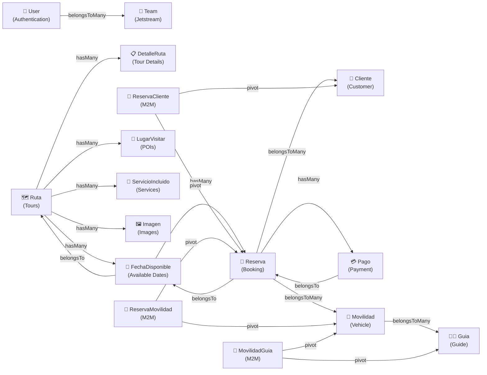
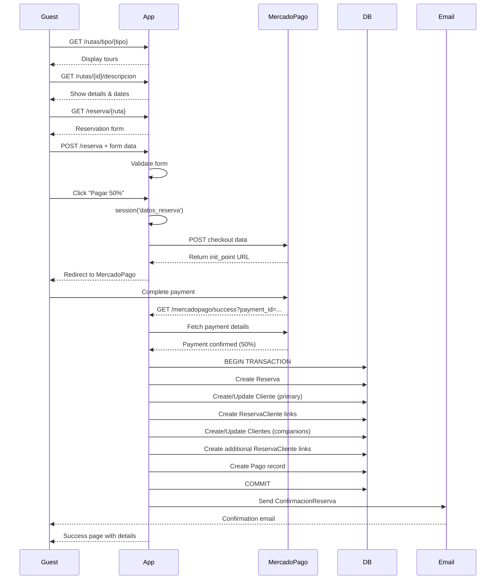
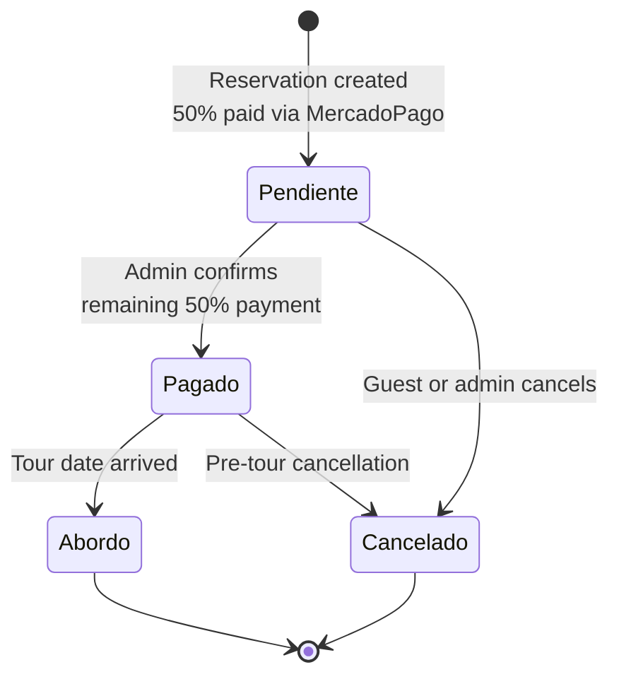

# System Overview: Outdoor Tour & Reservation Management System

## I. GENERAL OVERVIEW

**Project Type**: Laravel 11 SPA with Livewire & Jetstream  
**Domain**: Outdoor Adventure Tours & Reservation Management  
**Language**: PHP (Backend), JavaScript (Frontend), Spanish (UI/Domain)  
**Architecture Pattern**: MVC (Model-View-Controller) with Resource Controllers  
**Authentication**: Jetstream + Sanctum + Spatie Permission

**Core Business Concept**: A comprehensive tour booking platform supporting multi-person reservations with integrated payment processing, guide assignment, and vehicle management.

## II. TECHNOLOGY STACK

| Layer | Technology | Purpose |
|-------|-----------|---------|
| **Framework** | Laravel 11 | Backend framework |
| **Frontend** | Livewire 3, Blade | Dynamic UI, templating |
| **Styling** | Tailwind CSS, Bootstrap 5, SCSS | Responsive design |
| **Build Tool** | Vite 6 | Asset bundling, hot reload |
| **Admin UI** | AdminLTE 3.15 | Dashboard & admin interface |
| **Authentication** | Jetstream + Sanctum | User auth & API tokens |
| **Authorization** | Spatie Permission 6.19 | Role-based access control |
| **Payment** | MercadoPago DX PHP 3.4 | Payment processing |
| **Audit** | Spatie ActivityLog 4.10 | Activity tracking & logging |
| **Testing** | PHPUnit 11, Mockery | Unit & feature tests |
| **Code Quality** | Laravel Pint | Code styling |
| **Dev Tools** | Tinker, Pail, Sail | Debugging & development |

## III. MODULE MAP & ARCHITECTURE

### 3.1 Public/Guest Routes

| Route | Controller | Purpose |
|-------|-----------|---------|
| `/` | HomeController@home | Homepage with featured tours |
| `/rutas/tipo/{tipo}` | HomeController@rutasPorTipo | Filter tours by type (Trekking, Aventura) |
| `/rutas/{id}/descripcion` | HomeController@mostrarDescripcion | Display tour details & availability |
| `/blog` | HomeController@blog | Blog/news section |
| `/reserva/{ruta}` | ReservaClienteController@formulario | Reservation form for guests |
| `/reserva` (POST) | ReservaClienteController@store | Submit reservation |

### 3.2 Payment Processing (MercadoPago)

| Endpoint | Method | Purpose |
|----------|--------|---------|
| `/checkout` | POST | Initiate MercadoPago checkout |
| `/mercadopago/success` | GET | Handle successful payment |
| `/mercadopago/failure` | GET | Handle failed payment |

### 3.3 Protected/Authenticated Routes (Middleware: `auth`, `verified`)

#### **Tours Management**
- `resource('rutas', RutaController)` - CRUD for routes/tours
- `resource('detalleruta', DetalleRutaController)` - Tour details/itinerary
- `resource('imagen', ImagenController)` - Tour images
- Middleware: Permission checks (`rutas.ver`, `rutas.crear`, `rutas.editar`, `rutas.eliminar`)

#### **Availability & Bookings**
- `resource('fechas', FechaDisponibleController)` - Available dates per tour
- `resource('gestionreservas', ReservaController)` - Manage reservations
- `POST /gestionreservas/buscar` - Search reservations by DNI (national ID)
- `resource('listareservas', ListarReservasController)` - List reservations
- `resource('reservasmovilidad', ReservaMovilidadController)` - Link vehicles to reservations

#### **Support Data**
- `resource('lugares', LugarVisitarController)` - Points of interest on routes
- `resource('servicios', ServicioIncluidoController)` - Included services (meals, gear, etc.)

#### **People Management**
- `resource('clientes', ClienteController)` - Manage clients/customers
- `resource('guias', GuiaController)` - Manage tour guides
- `resource('movilidades', MovilidadController)` - Manage vehicles/transport
- `resource('pagos', PagoController)` - Manage payments

#### **Reporting & Admin**
- `GET /movilidad` - Vehicle utilization dashboard
- `/movilidad-reporte/rutas` - Routes by date
- `/movilidad-reporte/movilidades` - Vehicles per route
- `/movilidad-reporte/manifiesto` - Manifest per vehicle
- `resource('roles', RoleController)` - Manage roles
- `resource('permisos', PermissionController)` - Manage permissions
- `GET /logs` - Activity audit logs
- `GET /dashboard` - Main dashboard with analytics

## IV. DATA MODELS & RELATIONSHIPS

### 4.1 Entity Relationship Diagram

### 4.2 Core Models & Key Attributes

| Model | Primary Key | Key Attributes | Relationships |
|-------|------------|-----------------|----------------|
| **Ruta** | `id_ruta` | nombre_ruta, tipo, precio_regular, descuento, precio_actual, hora_salida, dificultad, estado | hasMany: DetalleRuta, FechaDisponible, LugarVisitar, ServicioIncluido, Imagen |
| **FechaDisponible** | `id_fecha` | id_ruta, fecha | belongsTo: Ruta; hasMany: Reserva |
| **DetalleRuta** | `id_detalle` | id_ruta, descripcion | belongsTo: Ruta |
| **LugarVisitar** | `id_lugar` | id_ruta, nombre_lugar | belongsTo: Ruta |
| **ServicioIncluido** | `id_servicio` | id_ruta, servicio | belongsTo: Ruta |
| **Imagen** | `id_imagen` | id_ruta, url_imagen | belongsTo: Ruta |
| **Reserva** | `id_reserva` | id_fecha, fecha_reserva, cantidad_personas, precio_total, saldo, estado | belongsTo: FechaDisponible; belongsToMany: Cliente, Movilidad; hasMany: Pago |
| **Cliente** | `id_cliente` | nombre, apellido, tipo_documento, numero_documento, fecha_nacimiento, email, telefono, pais, region, ciudad | belongsToMany: Reserva |
| **ReservaCliente** | Composite (id_reserva, id_cliente) | — | Pivot table |
| **Pago** | `id_pago` | id_reserva, metodo_pago, monto_pagado, fecha_pago | belongsTo: Reserva |
| **Movilidad** | `id_movilidad` | ruta, empresa, conductor, placa, tipo_movilidad, capacidad, estado | belongsToMany: Reserva, Guia |
| **MovilidadGuia** | Composite (id_movilidad, id_guia) | — | Pivot table |
| **ReservaMovilidad** | Composite (id_reserva, id_movilidad) | — | Pivot table |
| **Guia** | `id_guia` | nombre, apellido, telefono, email | belongsToMany: Movilidad |
| **User** | id | name, email, password, roles, permissions | HasRoles (Spatie), HasTeams (Jetstream) |

## V. BUSINESS FLOW & PROCESSES

### 5.1 Reservation Flow (Guest → Payment → Confirmation)

### 5.2 Tour Management Flow (Admin)

```mermaid
graph TD
    Admin["Admin/Manager"]
    
    Admin -->|Create Tour| RutaController["RutaController<br/>@store"]
    RutaController --> CreateRuta["Create Ruta<br/>- name, type, price<br/>- difficulty, start time"]
    
    Admin -->|Add Details| DetalleRutaController["DetalleRutaController"]
    DetalleRutaController --> AddDetail["Add itinerary<br/>description"]
    
    Admin -->|Add Locations| LugarVisitarController["LugarVisitarController"]
    LugarVisitarController --> AddLocation["Add POIs<br/>- name_lugar"]
    
    Admin -->|Add Services| ServicioIncluidoController["ServicioIncluidoController"]
    ServicioIncluidoController --> AddService["Add included<br/>services"]
    
    Admin -->|Upload Images| ImagenController["ImagenController"]
    ImagenController --> AddImage["Add tour<br/>images"]
    
    Admin -->|Schedule Dates| FechaDisponibleController["FechaDisponibleController"]
    FechaDisponibleController --> AddDate["Create available<br/>dates"]
    
    Admin -->|Assign Transport| MovilidadController["MovilidadController"]
    MovilidadController --> AddVehicle["Add vehicle<br/>details"]
    
    Admin -->|Assign Guides| GuiaController["GuiaController"]
    GuiaController --> AddGuide["Add guide<br/>info"]
    
    Admin -->|Link Guides to Vehicles| ReservaMovilidadController["ReservaMovilidadController"]
    ReservaMovilidadController --> LinkGuideVehicle["Connect movilidad_guias"]
    
    Admin -->|View Reports| Dashboard["DashboardController"]
    Dashboard --> ViewMetrics["View KPIs, charts"]
```

### 5.3 Payment & Reservation Status

## VI. DESIGN PATTERNS & ARCHITECTURE

### 6.1 Design Patterns Used

| Pattern | Where | Purpose |
|---------|-------|---------|
| **MVC** | Overall app structure | Separation of concerns |
| **Resource Controllers** | All CRUD routes | RESTful convention |
| **Repository Pattern** | Eloquent Models | Data abstraction |
| **Service Layer** | MercadoPagoController | External API integration |
| **Middleware Chain** | Authentication, authorization | Cross-cutting concerns |
| **Many-to-Many** | Reserva↔Cliente, Movilidad↔Guia | Complex relationships |
| **Pivot/Junction Tables** | reserva_clientes, movilidad_guias | Join table pattern |
| **Query Eager Loading** | `with()` clauses | N+1 query prevention |
| **Policy-Based Authorization** | TeamPolicy | Fine-grained permissions |
| **Activity Logging** | Spatie Activitylog | Audit trail pattern |
| **Session-Based State** | `session('datos_reserva')` | Temporary state management |

### 6.2 Authorization & Permission Structure

**Authentication**:
- Jetstream handles user registration, email verification, 2FA
- Sanctum provides API token support
- MustVerifyEmail contract on User model

**Authorization**:
- Spatie Permission: Role-based access control
- Middleware checks: `can:permission.name`
- Resource permissions: `rutas.ver`, `rutas.crear`, `rutas.editar`, `rutas.eliminar`
- Dashboard & report permissions: `dashboard.ver`

**Roles** (inferred from code):
- Admin
- Manager/Staff
- Usuario (regular user)

## VII. CRITICAL AREAS & POTENTIAL ISSUES

### 7.1 Current Issues & Observations

| Issue | Severity | Location | Impact |
|-------|----------|----------|--------|
| ReservaClienteController@store is commented out | HIGH | app/Http/Controllers/ReservaClienteController.php#L26 | Direct reservation without payment not functional |
| Pago model has incorrect relationship | MEDIUM | app/Models/Pago.php#L22 | Comment shows confusion; hasMany used instead of belongsTo |
| ReservaMovilidad has no explicit composite key in model | LOW | app/Models/ReservaMovilidad.php | Database has composite; model lacks explicit definition |
| MovilidadGuia primaryKey as array may cause issues | MEDIUM | app/Models/MovilidadGuia.php#L11 | Composite key definition may not work in all scenarios |
| No explicit FormRequest validation classes | MEDIUM | app/Http/Controllers/RutaController.php#L35 | Validation in controller; violates best practice |
| Reserva timestamps = false | LOW | app/Models/Ruta.php#L16 | While Ruta has timestamps:false, Reserva has timestamps |
| ReservaCliente model has wrong primaryKey | MEDIUM | app/Models/ReservaCliente.php#L9 | Composite key not defined; impacts queries |
| User email verification required but not enforced everywhere | LOW | app/Models/User.php#L25 | MustVerifyEmail on User model |

### 7.2 Best Practices Not Followed

1. **No FormRequest Classes**: Validation hardcoded in controllers
2. **N+1 Query Risk**: Some controllers lack eager loading
3. **Missing Transaction Handling**: Not all DB operations wrapped in transactions
4. **No Audit for Critical Operations**: Activity log only on Ruta model
5. **Session-Based State**: `datos_reserva` stored in session; could use database cache
6. **No Rate Limiting**: Payment endpoint not rate-limited
7. **Minimal Error Handling**: Some try-catch blocks log but don't handle edge cases

### 7.3 Scalability Considerations

- **Payment Webhook**: Should implement MercadoPago IPN/webhook for async confirmation
- **Async Emails**: Email sending in request cycle; consider queue
- **Report Queries**: Raw SQL joins in DashboardController; consider caching or materialized views
- **Composite Keys**: Pivot tables use composite keys; may cause ORM friction at scale
- **File Storage**: Images likely stored locally; consider cloud storage (S3) for production

## VIII. SUMMARY TABLE: ENTITIES & ROLES

| Entity | Role | Primary Key | Relationships | Status |
|--------|------|------------|----------------|--------|
| **Ruta** | Core tour definition | id_ruta | hasMany: dates, details, POIs, services, images | ✅ Fully operational |
| **FechaDisponible** | Availability scheduling | id_fecha | belongsTo: Ruta; hasMany: Reservas | ✅ Operational |
| **Reserva** | Booking record | id_reserva | belongsTo: FechaDisponible; M2M: Clientes, Movilidads; hasMany: Pagos | ⚠️ Partially (direct booking commented) |
| **Cliente** | Customer data | id_cliente | M2M: Reservas | ✅ Operational |
| **Pago** | Payment transaction | id_pago | belongsTo: Reserva | ⚠️ Relationship bug |
| **Movilidad** | Transport asset | id_movilidad | M2M: Reservas, Guias | ✅ Operational |
| **Guia** | Tour guide staff | id_guia | M2M: Movilidads | ✅ Operational |
| **User** | System user/admin | id | HasRoles, HasTeams | ✅ Operational |

## IX. POTENTIAL ENHANCEMENTS & ROADMAP

### Short-term Fixes
1. Create FormRequest validation classes
2. Fix Pago model relationships
3. Implement composite key handling in Pivot models
4. Add transaction handling to ReservaCliente store
5. Extend activity logging to all critical models

### Medium-term Improvements
1. Implement MercadoPago webhook/IPN for async payment confirmation
2. Queue email sending (reservation confirmations)
3. Create API endpoints for mobile app
4. Add comprehensive test suite
5. Implement pagination for list views
6. Add data export (PDF, CSV) for reports

### Long-term Features
1. Multi-language support (i18n)
2. Dynamic pricing & promotions
3. Cancellation/refund policies
4. Guide availability calendar
5. Customer portal for self-service booking changes
6. SMS notifications
7. Loyalty program / reward points
8. Integration with booking platforms (Airbnb, Viator)

## CONCLUSION

The **AGENTS** project is a well-structured Laravel 11 application for managing outdoor tour reservations with integrated payment processing. It follows MVC architecture with Jetstream for auth and Spatie for permissions/logging. The core business flow is functional through MercadoPago integration, though some cleanup of models and validation is needed for production robustness. The project demonstrates good use of relationships, though several models lack explicit composite key definitions and some best practices (FormRequests, async processing) could be improved.

**Overall Assessment**:
- ✅ **Architecture**: Solid MVC with proper resource controllers
- ✅ **Database**: Well-normalized schema with appropriate relationships
- ⚠️ **Code Quality**: Some inconsistencies in model definitions & validation
- ⚠️ **Testing**: Minimal coverage beyond Jetstream scaffolding
- ⚠️ **Documentation**: Limited inline documentation; API and domain logic undocumented

This analysis document provides a complete blueprint for development, debugging, and future enhancements.